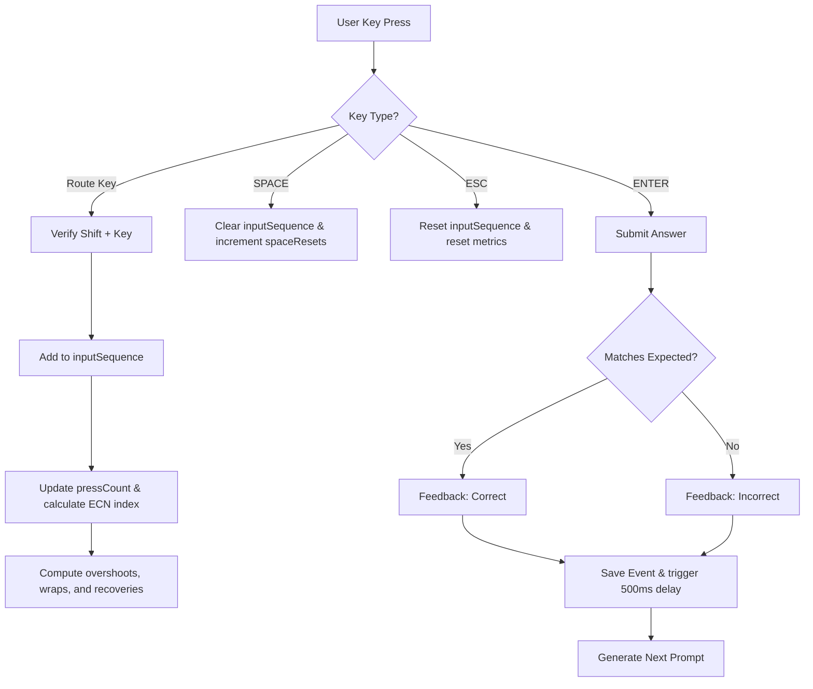

# ECN Execution Trainer - Architecture & Design Specification

This document details the architectural layout, modules, and algorithms for the **ECN Execution Trainer**. The application is a pure client-side training tool built using React, TypeScript, Tailwind CSS v4, and Zustand, with persistent tracking stored in LocalStorage.

---

## 1. Folder Structure

We use a clean, modular directory structure that separates core business logic (engines) from React UI components. This ensures maximum testability, maintainability, and reusability of logic.

```
key-practice/
├── docs/
│   ├── spec.md               # User specifications
│   └── architecture.md       # Architectural design (this file)
├── src/
│   ├── assets/               # SVGs, images, logo assets
│   ├── core/                 # Pure TypeScript business logic (Framework-agnostic)
│   │   ├── routing.ts        # ECN keys, input processing, and error-recovery tracking
│   │   ├── analytics.ts      # Math utilities for session aggregates, mistargets, and heatmaps
│   │   ├── learning.ts       # Weight adjustments and weighted random selection algorithm
│   │   └── storage.ts        # LocalStorage serialization/deserialization wrapper
│   ├── store/
│   │   └── trainerStore.ts   # Zustand global state manager orchestrating the engines
│   ├── hooks/
│   │   ├── useKeyboard.ts    # React listener for Shift + keys, Enter, Space, Esc, and Arrows
│   │   └── useLiveTimer.ts   # High-resolution animation frame timer for milliseconds
│   ├── components/           # Reusable UI components
│   │   ├── Dashboard.tsx     # Session setup, configuration panel, and stats overview
│   │   ├── Trainer.tsx       # Live training environment (prompts, timer, key capture)
│   │   ├── Analytics.tsx     # In-depth stats, charts, and mistake tables
│   │   ├── Heatmap.tsx       # ECN weakness grid with color intensities
│   │   ├── HistoryList.tsx   # Past session log browser
│   │   └── Common/           # Generic buttons, badges, modals, cards
│   ├── App.tsx               # Main layout entrypoint and view switching
│   ├── index.css             # Tailwind CSS import
│   ├── main.tsx              # React DOM mounting
│   └── vite-env.d.ts         # Vite TypeScript declarations
├── package.json              # Dependencies (React 19, TS 6, Tailwind v4, Zustand 5, React Icons)
├── tsconfig.json             # Root TypeScript config
└── vite.config.ts            # Vite config (Tailwind & React plugins)
```

---

## 2. TypeScript Interfaces

The data structures must capture all user actions, key inputs, and metrics. We define these types globally or inside a core typing declaration file.

```typescript
export type ActionType = 'BUY' | 'SELL';

export type ECN =
  | 'NSDQ' | 'ARCA' | 'EDGX' | 'EDGA'  // Group A
  | 'NYSE' | 'NSEX' | 'IEX'            // Group S
  | 'CHX'  | 'PHLX'                    // Group D
  | 'MEMX' | 'MIAX' | 'AMEX'           // Group Z
  | 'BATS' | 'BATY' | 'BOSX';          // Group X

export interface Prompt {
  action: ActionType;
  ecn: ECN;
  priceAdjustment?: number; // In cents (e.g. +3, -2). 0/undefined if ECN-only mode
}

export interface InputMetrics {
  overshoots: number;     // Number of presses beyond target ECN index in active group
  wraps: number;          // Number of times the index wrapped around the group length
  recoveries: number;     // Number of times the user overshot/wrapped but corrected back to target
  spaceResets: number;    // Number of times the Spacebar was pressed to clear selection
}

export interface SessionEvent {
  id: string;
  timestamp: number;
  prompt: Prompt;
  expectedEcn: ECN;
  actualEcn: ECN;
  action: ActionType;
  reactionTimeMs: number;
  usedSpaceReset: boolean;
  keySequence: string[];  // Raw sequence of letters pressed (e.g., ['A', 'A'])
  correct: boolean;
  priceCorrect?: boolean;             // For ECN + Price mode
  expectedPriceAdjustment?: number;   // Expected cents adjustment
  actualPriceAdjustment?: number;     // User entered cents adjustment
  metrics: InputMetrics;
}

export interface Session {
  id: string;
  date: string;                       // ISO Date String
  mode: 'ecn' | 'price' | 'mixed' | 'weakness';
  accuracy: number;                   // Final overall percentage (0-100)
  averageTime: number;                // In milliseconds
  events: SessionEvent[];
}

export interface ECNWeightMap {
  [ecn: string]: number;              // Current adaptive weight of ECN (starts at 1.0)
}
```

---

## 3. State Management Design (Zustand)

Global state is managed by a single cohesive Zustand store. This store brings together config state, active trainer session state, and historical data.

### Store Schema

```typescript
interface TrainerState {
  // Navigation & UI State
  currentView: 'dashboard' | 'trainer' | 'analytics' | 'history';
  
  // Settings / Config
  mode: 'ecn' | 'price' | 'mixed' | 'weakness';
  smartLearning: boolean;
  soundEnabled: boolean;
  
  // Live Session Variables
  isSessionActive: boolean;
  currentPrompt: Prompt | null;
  inputSequence: string[];            // Tracks keys pressed for ECN routing (e.g. ['A', 'A'])
  userPriceAdjustment: number;        // Tracked price adjustments in cents (default: 0)
  startTime: number | null;           // Date.now() timestamp when prompt is shown
  feedback: {
    correct: boolean;
    priceCorrect?: boolean;
    expectedEcn: ECN;
    expectedPrice?: number;
    reactionTimeMs: number;
  } | null;                           // 500ms feedback state
  
  // Accumulated Current Session Events
  currentSessionEvents: SessionEvent[];
  spaceResetsInCurrentPrompt: number;
  overshootsInCurrentPrompt: number;
  wrapsInCurrentPrompt: number;
  recoveriesInCurrentPrompt: number;

  // History & Metrics (loaded from LocalStorage)
  sessions: Session[];
  ecnWeights: ECNWeightMap;
  
  // Actions
  setView: (view: 'dashboard' | 'trainer' | 'analytics' | 'history') => void;
  updateSettings: (settings: Partial<Pick<TrainerState, 'mode' | 'smartLearning' | 'soundEnabled'>>) => void;
  
  // Session Controls
  startSession: () => void;
  endSession: () => void;
  nextPrompt: () => void;
  
  // Input Triggers
  pressRouteKey: (key: string) => void;
  adjustPrice: (delta: number) => void;
  submitAnswer: () => void;
  resetPromptInput: () => void;      // Triggered by SPACE
  clearPromptInput: () => void;      // Triggered by ESC
  
  // Data actions
  clearHistory: () => void;
}
```

### High-Resolution Millisecond Timer Hook
To avoid rendering the whole Zustand store every 10ms for a timer display, a dedicated React hook will handle the live timer using `requestAnimationFrame`. When `startTime` is set in the store, the UI component subscribes to the trigger and updates a local ref/node directly for optimal performance.

---

## 4. Routing Engine Design

The Routing Engine is the core input processing module. It maps keyboard inputs to ECN routes and evaluates metric counts (overshoots, wraps, recoveries).

### ECN Keyboard Mappings

```typescript
export const ECN_GROUPS = {
  BUY: {
    'A': ['NSDQ', 'ARCA', 'EDGX', 'EDGA'],
    'S': ['NYSE', 'NSEX', 'IEX', 'NYSE'], // Cycles NYSE on 4th press
    'D': ['CHX', 'PHLX'],
    'Z': ['MEMX', 'MIAX', 'AMEX'],
    'X': ['BATS', 'BATY', 'BOSX']
  },
  SELL: {
    'L': ['NSDQ', 'ARCA', 'EDGX', 'EDGA'],
    '';': ['NYSE', 'NSEX', 'IEX'],
    '\'': ['CHX', 'PHLX'],
    ',': ['MEMX', 'MIAX', 'AMEX'],
    '.': ['BATS', 'BATY', 'BOSX']
  }
};
```

### Input Tracking Algorithm
When the user is prompted (e.g. `BUY ARCA`):
1. **Target Identification**:
   * Target group key: `'A'` (Buy Group A contains `ARCA`).
   * Target index: `1` (0-indexed: `NSDQ=0`, `ARCA=1`).
   * Target press count: `2` presses.
2. **Key Capture & Indexing**:
   * As the user presses keys (e.g., `'A'`), we record the presses.
   * `currentIndex = (pressCount - 1) % GroupLength`.
3. **Metric Calculations**:
   * **Wrap-around**: `wraps = Math.floor((pressCount - 1) / GroupLength)`.
   * **Overshoot**: If `pressCount > targetPressCount`, the user has pressed too many times for the targeted ECN.
     * `overshootCount = Math.max(0, pressCount - targetPressCount)`.
   * **Recovery**: A recovery is detected when the user has overshot (`pressCount > targetPressCount`), but continues to press until `currentIndex === targetIndex` again within the wrap-around loops.
     * `isRecovered = pressCount > targetPressCount && currentIndex === targetIndex`.
     * The engine increments `recoveries` if `isRecovered` is true when the user hits Enter.

### Input Submission Flowchart


---

## 5. Analytics Design

The Analytics module processes the session history array stored in LocalStorage to provide deep insights on user muscle memory.

### Aggregate Math Formulas
* **Overall Accuracy ($A_{overall}$)**:
  $$A_{overall} = \left( \frac{\sum \text{Correct Events}}{\sum \text{Total Events}} \right) \times 100$$
* **Average Reaction Time ($T_{avg}$)**:
  $$T_{avg} = \frac{\sum_{i=1}^{N} \text{reactionTimeMs}_i}{N}$$ (calculated for all submitted answers or correct answers selectively).
* **Per-ECN Accuracy ($A_{ecn}$)**:
  $$A_{ecn} = \left( \frac{\text{Correct Events for ECN}}{\text{Total Events for ECN}} \right) \times 100$$

### Error Correlation Grid (Common Mistakes)
Tracks transitions where the user intended to execute route $A$ but submitted route $B$.
* We build a frequency hash map: `{ [expected_ecn + " -> " + actual_ecn]: count }`.
* Sorted in descending order of count to display top 5 typing slips (e.g., `MEMX -> MIAX: 12`).

### Heatmap Matrix
We construct a visual grid mapping all 15 ECNs.
* Each cell calculates its $A_{ecn}$ percentage.
* A tailwind class is applied dynamically based on threshold ranges:
  * $A_{ecn} \ge 90\%$: Deep emerald background (`bg-emerald-500/20 text-emerald-400 border-emerald-500/40`).
  * $75\% \le A_{ecn} < 90\%$: Amber background (`bg-amber-500/20 text-amber-300 border-amber-500/40`).
  * $A_{ecn} < 75\%$: Crimson background (`bg-rose-500/20 text-rose-400 border-rose-500/40`).
  * No data: Muted slate (`bg-slate-900/50 text-slate-500 border-slate-800`).

---

## 6. Smart Learning Design

The smart learning engine dynamically modifies the probability of prompts based on historical weaknesses.

### Weighting Algorithm
1. **Initialization**: Every ECN is initialized with a base weight $W_{ecn} = 1.0$.
2. **Adjustment**:
   * When an ECN is answered **incorrectly**:
     $$W_{ecn} = W_{ecn} + 2.0$$
   * When an ECN is answered **correctly**:
     $$W_{ecn} = \max(1.0, W_{ecn} - 0.5)$$
3. **Probability Selection (Weighted Random)**:
   * To select the next ECN, calculate the cumulative weight sum:
     $$S = \sum_{j=1}^{M} W_{j}$$
   * Generate a random float $R \in [0, S)$.
   * Scan through the ECN list, accumulating weights:
     $$Acc_k = \sum_{i=1}^{k} W_{i}$$
   * The first ECN where $Acc_k > R$ is selected for the prompt.

This mathematical model ensures that a repeatedly missed ECN becomes up to 3x more likely to appear on subsequent prompts, creating a tight feedback loop that optimizes learning.

---

## 7. Routing Engine Design - Edge Cases

To ensure complete production-readiness, the engine specifies handling for the following edge cases:
* **Key Interruption**: If the user starts pressing Buy Group A ('A') but then presses Buy Group S ('S') without submitting, the routing engine discards the keypresses for Group A, resets the metrics, and makes Group S the active group.
* **Non-shift presses**: Pressing route keys without holding Shift registers as a mistake, triggering a visual reminder in the input display.
* **Key Repeat / Hold**: Physical key repeats due to holding down keys are debounced to ensure they count as single presses.

---

## 8. Development Verification Plan

* **Unit Testing Matrix**: Core routing and learning functions will be verified with mock keystroke arrays (e.g. simulating `Shift+A+A+A` -> output `EDGX` with 1 overshoot).
* **Local Run Command**: Run `npm run dev` and test key inputs via keyboard to ensure immediate HMR reflection.
